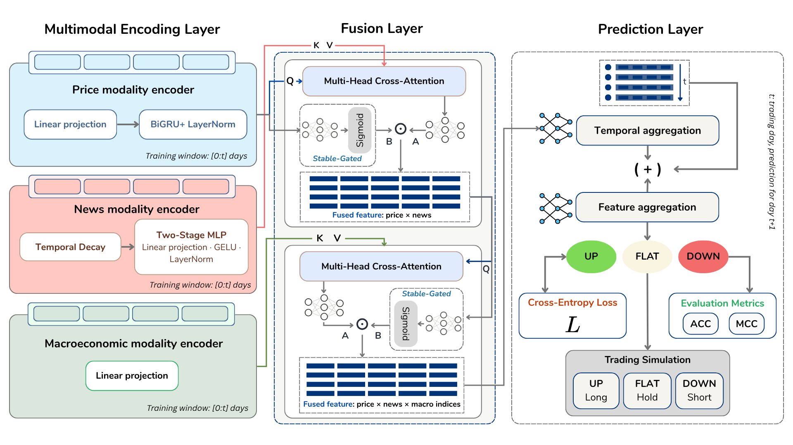
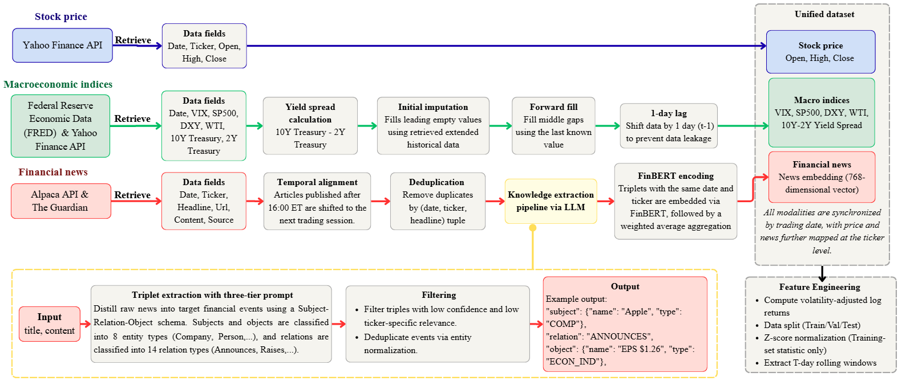
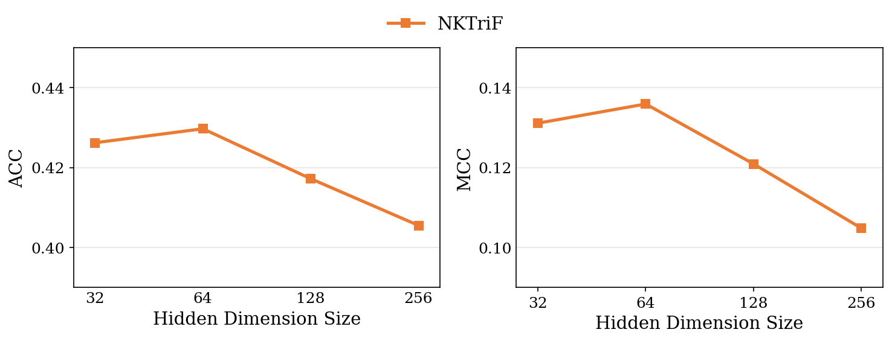
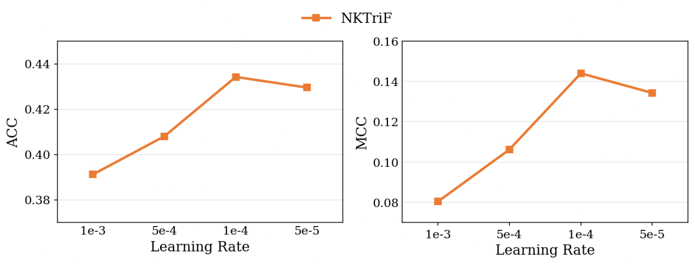
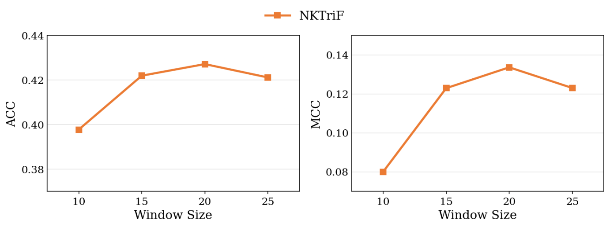

# NKTriF: News-Knowledge Tri-modal Fusion for Stock Movement Prediction

> A Multimodal Stable Fusion Approach for Fine-Grained Stock Movement Prediction: Empirical Evidence from the U.S. Stock Market
> *Submitted to COMBELT-2026 (The International Conference on Management, Business, Economics, Law and Technology), Danang, Vietnam.*

## Overview

Short-horizon stock movement prediction means combining several different kinds of
market signals: historical prices, macroeconomic conditions, and event-driven news.
These signals differ in structure, update frequency, and reliability, and prior work
still has two main gaps:

- **No conflict-aware fusion.** Conventional fusion treats all modalities as equally
  reliable. When signals disagree (e.g. price declining while news sentiment is
  positive), the resulting joint representation ends up faithfully reflecting neither.
- **Noisy raw financial text.** A single article often covers multiple companies and is
  padded with linguistic filler around the financially relevant claims. Encoding it at
  the headline or document level dilutes the stock-specific signal.

**NKTriF (News-Knowledge Tri-modal Fusion)** addresses both gaps:

1. **Structured news extraction.** Raw articles are distilled into Subject-Relation-
   Object (S-R-O) triples via LLM few-shot prompting with a schema-constrained
   taxonomy. This isolates ticker-specific events from surrounding noise before
   embedding.
2. **Two-stage Gated Cross-Attention fusion.** At each fusion stage, a price-conditioned
   stabilizing gate suppresses auxiliary signals that conflict with the price context,
   rather than blending all modalities uniformly.

Across 8 S&P 500 tickers, NKTriF outperforms all six price/news/macro baselines on both
accuracy and the Matthews Correlation Coefficient (MCC). It also delivers the strongest
risk-adjusted trading performance among all compared models, with a Sharpe ratio of
+0.85 net of transaction costs.

## Methodology

The model has three sequential stages: **Encoder → Fusion → Prediction**. Each modality
is first projected into a shared *d*-dimensional latent space. The encoded modalities are
then fused under gated conflict regulation, and finally decoded into a 3-class movement
label (Down / Flat / Up).

- **Price modality encoder.** Linear projection of each indicator (volatility-normalized
  open/high/close log-returns), followed by a Bidirectional GRU, then a residual
  connection and LayerNorm.
- **News modality encoder.** Takes the precomputed daily news embedding sequence and
  reweights it with a **temporal-decay** coefficient, giving more weight to news closer
  to the forecast date. The result passes through a two-stage linear projection with
  GELU and LayerNorm.
- **Macroeconomic modality encoder.** A single linear projection of 5 z-scored indices,
  which are already low-dimensional, structured, and lagged by one trading day.
- **Fusion layer.** Two sequential **Gated Cross-Attention (GCA)** stages combine the
  three encoded modalities:
  - *Stage 1*: price (primary/query) attends over news (auxiliary/key-value), producing
    a price-news representation.
  - *Stage 2*: the price-news representation (primary) attends over macro (auxiliary),
    producing the final joint representation.

  News is fused before macro because the two carry different kinds of information: news
  reflects short-horizon event shocks, while macro reflects slow-moving, regime-level
  context. At each stage, a sigmoid gate derived strictly from the stable primary anchor
  decides which part of the cross-attended auxiliary signal to keep, and suppresses the
  rest.
- **Prediction layer.** A 3-layer MLP compresses the temporal dimension of two
  representations independently: the final fused representation, and the original price
  representation kept as an undistorted parallel stream. The two compressed vectors are
  concatenated and linearly projected to 3-class logits. The whole model is trained
  end-to-end with Cross-Entropy loss via AdamW.


*Fig. 1. Framework of the proposed multimodal NKTriF model.*

**Data construction pipeline.** Three data streams are collected and synchronized into
one dataset:

- **Price & macro.** Stock prices and macroeconomic indices come from Yahoo Finance
  (plus FRED for some macro series). Both are cleaned and lagged by one trading day to
  prevent lookahead bias.
- **News.** Articles come from the Alpaca API and The Guardian. Articles published after
  16:00 ET are rolled over to the next trading session, and duplicates are removed.
- **Knowledge extraction.** Each article is distilled into Subject-Relation-Object
  (S-R-O) triples through a three-tier LLM prompting pipeline (8 entity types, 14
  relation types). Low-confidence or low-relevance triples are filtered out. The
  remaining triples are embedded with FinBERT and aggregated into one
  confidence/impact/relevance-weighted daily embedding per ticker.

All three streams are then synchronized by trading date (and by ticker, for price and
news) into the unified dataset.


*Fig. 2. The preprocessing and unified dataset construction workflow.*

> The S-R-O extraction and FinBERT embedding step runs in a separate preprocessing
> project. This repository only consumes its output (per-date, per-ticker embedding
> vectors) as an input file. See [`main_test.py`](main_test.py).

## Experimental Setup

- **Universe.** 8 S&P 500 constituents across 4 sectors: **TSLA, AMZN** (Consumer
  Discretionary); **AAPL, MSFT, GOOGL, META** (Technology); **BA** (Industrials);
  **WMT** (Consumer Staples).
- **Period.** January 1, 2022 to June 23, 2025 (869 valid trading sessions).
- **Labeling.** Each label is based on the next-session simple return compared against
  rolling 20-day percentile thresholds (Up / Down / Flat). This yields a near-balanced
  class distribution:

  | Ticker | Sector | DOWN | FLAT | UP | Total |
  |---|---|---|---|---|---|
  | TSLA | Consumer Discretionary | 283 | 282 | 284 | 849 |
  | AAPL | Technology | 282 | 284 | 283 | 849 |
  | AMZN | Consumer Discretionary | 282 | 285 | 282 | 849 |
  | MSFT | Technology | 284 | 281 | 284 | 849 |
  | GOOGL | Technology | 283 | 282 | 284 | 849 |
  | META | Technology | 282 | 284 | 283 | 849 |
  | BA | Industrials | 284 | 281 | 284 | 849 |
  | WMT | Consumer Staples | 283 | 283 | 283 | 849 |
  | **Total** | | **2,263** | **2,262** | **2,267** | **6,792** |

  *Table 2. Label distribution across the experimental dataset.*

- **Split.** Chronological 70% train, 15% validation, 15% test, with no overlap.
  Z-score normalization is fit on the training split only.
- **Window.** 14-day look-back per sample (`T = 14`).
- **Baselines** (6, grouped by input modality):
  - Price only: **LSTM**, **ALSTM** (temporal attention over hidden states)
  - Price + news: **ALSTM-W** (window-averaged FinBERT embeddings), **SLOT**
    (per-timestep price/text cross-projection)
  - Price + macro: **ESTIMATE** (concat + multi-head attention), **DTML** (multi-level
    Transformer over temporal/cross-variable dependencies)
- **Hyperparameter search.** A grid search covers learning rate {5e-5, 1e-4, 5e-4},
  hidden dimension {32, 64, 128}, and dropout {0.1, 0.2}. The combination that maximizes
  validation MCC is selected. NKTriF additionally fixes 4 attention heads and a temporal
  decay of 0.1.
- **Evaluation.** Accuracy (ACC) and Matthews Correlation Coefficient (MCC), computed
  over 5 independent random seeds. Mean and standard deviation are reported.
- **Trading simulation.** A daily long/short portfolio is rebalanced using the model's
  softmax output as a confidence-weighted signal. Capital is split evenly between the
  long and short legs, net of a 4 bps per-side transaction cost. Performance is
  evaluated via the Annualized Sharpe Ratio and the Geometric Annualized Return.

## Main Results

**Overall comparison.** NKTriF achieves the best ACC and MCC among all baselines. It
surpasses the strongest baseline, DTML, by +1.36 pp in ACC and +0.0158 in MCC (a 12.8%
relative MCC gain). Naively fusing news through conventional cross-modal projection
actually hurts performance instead: both ALSTM-W and SLOT underperform the unimodal
LSTM. This shows that the gain comes from the gated fusion mechanism, not simply from
adding more modalities.

| Method | Sources | ACC | MCC |
|---|---|---|---|
| LSTM | Price | 0.4193 ± 0.0087 | 0.1220 ± 0.0134 |
| ALSTM | Price | 0.4139 ± 0.0079 | 0.1162 ± 0.0117 |
| ALSTM-W | Price + news | 0.3799 ± 0.0073 | 0.0642 ± 0.0115 |
| SLOT | Price + news | 0.3709 ± 0.0073 | 0.0503 ± 0.0080 |
| ESTIMATE | Price + macro | 0.3986 ± 0.0069 | 0.0996 ± 0.0105 |
| DTML | Price + macro | 0.4188 ± 0.0045 | 0.1236 ± 0.0077 |
| **NKTriF (proposed)** | Price + news + macro | **0.4324 ± 0.0086** | **0.1394 ± 0.0152** |

*Table 3. Comparison of stock movement prediction performance across all models on the test set.*

**Modality contribution (ablation).** Removing news (`NKTriF-PM`) is the more damaging
ablation, with MCC dropping 24.8%. This confirms that news carries the primary
event-driven signal. Removing macro (`NKTriF-PN`) degrades mean MCC less (17.6%), but
more than doubles the cross-seed variance. In other words, macro indices act as a
structural regularizer that stabilizes training across regimes and initializations,
even though news is what drives absolute accuracy.

| Variant | ACC | MCC | ΔMCC |
|---|---|---|---|
| NKTriF | 0.4324 ± 0.0086 | 0.1394 ± 0.0152 | – |
| NKTriF-PM (no news) | 0.4107 ± 0.0077 | 0.1048 ± 0.0098 | −0.0346 (−24.8%) |
| NKTriF-PN (no macro) | 0.4170 ± 0.0227 | 0.1148 ± 0.0321 | −0.0246 (−17.6%) |

*Table 4. Ablation results on modality contribution.*

**Gating mechanism.** Removing the stabilizing gate (`NKTriF-NoGate`, using direct
residual addition instead) drops MCC by 29.8% and more than doubles the standard
deviation across seeds. The gate improves both mean accuracy and cross-seed stability
at the same time.

| Variant | ACC | MCC |
|---|---|---|
| NKTriF | 0.4324 ± 0.0086 | 0.1394 ± 0.0152 |
| NKTriF-NoGate | 0.4131 ± 0.0248 | 0.1074 ± 0.0346 |

*Table 5. Gated vs. non-gated fusion.*

**Fusion order.** Fusing news before macro (the proposed order, `NKTriF-NM`)
outperforms the inverted order (`NKTriF-MN`, macro before news) by 0.0231 MCC, with
lower variance too. This suggests that short-horizon event signals should be integrated
before slow-moving contextual ones, to preserve their representational capacity.

| Variant | ACC | MCC | ΔMCC |
|---|---|---|---|
| NKTriF-NM (price→news→macro, proposed) | 0.4324 ± 0.0086 | 0.1394 ± 0.0152 | – |
| NKTriF-MN (price→macro→news) | 0.4199 ± 0.0150 | 0.1163 ± 0.0228 | −0.0231 |

*Table 6. Fusion order variants.*

**Hyperparameter sensitivity.** Hidden dimension `d = 64`, learning rate `1e-4`, and
window size `20` all maximize validation MCC. Both smaller and larger settings degrade
performance, and insufficient window context (`ws = 10`) is the most damaging failure
mode.

|  |  |  |
|:---:|:---:|:---:|
| *Fig. 3. Hidden dimension* | *Fig. 4. Learning rate* | *Fig. 5. Window size* |

**Trading simulation.** NKTriF delivers the strongest risk-adjusted profile among all
models, and is the only multimodal method with a positive Sharpe ratio. Naive
multimodal baselines (ALSTM-W, DTML) underperform even the price-only LSTM, which
shows that unregulated auxiliary fusion erodes trading returns through excess turnover
on noisy signals.

| Model | Sharpe (net TC) | Ann. Return |
|---|---|---|
| **NKTriF (proposed)** | **+0.85** | **+27.68%** |
| LSTM | +0.78 | +26.98% |
| SLOT | −0.32 | +1.55% |
| ALSTM | −0.30 | −3.17% |
| ESTIMATE | −0.24 | −4.00% |
| ALSTM-W | −0.82 | −5.37% |
| DTML | −0.86 | −19.67% |
| Buy-and-Hold | – | −4.56% |

*Table 7. Financial performance (net-of-cost trading simulation).*

## Limitations & Future Work

- The current scope is limited to English-language news and US large-cap equities.
  Extending to emerging markets (e.g. Vietnam) would require more robust entity
  resolution and domain-adapted language models, since ticker-tagging infrastructure is
  less mature there.
- The architecture currently operates at daily frequency. Incorporating lower-frequency
  periodic disclosures (earnings reports, 10-K/10-Q filings) with an explicit
  post-publication temporal decay would be a natural extension toward multi-horizon
  forecasting.

---

## Repository Structure

```
configs/            Global and training configuration (paths, tickers, hyperparameters)
data_pipeline/       Raw data fetching (Yahoo Finance, Alpaca) and processing
  fetchers/          Price + macro (Yahoo) and news (Alpaca) API clients
  processors/        Price/macro cleaning, news alignment
  builder.py         Synchronizes price + macro + precomputed news embeddings into
                      the unified dataset
encoders/            Per-modality encoders (Section 3.3)
  indicator_encoder.py  Price encoder (projection + BiGRU + residual/LayerNorm)
  news_encoder.py       News encoder (temporal decay + two-stage projection)
  macro_encoder.py      Macro encoder (single linear projection)
  multi_encoder.py      Wraps all three into the multimodal encoding layer
src/
  fusion.py          Gated Cross-Attention (GCA) fusion stage
  predictor.py        Prediction layer (3-layer MLP temporal compression + classifier)
  model.py             End-to-end NKTriF model (encoders → fusion → predictor) + loss
  data_loader.py       Windowing, labeling, chronological splitting, normalization
  modules/layers.py    Shared building blocks (ThreeLayerMLP)
main.py              Training entry point (multi-ticker, saves output/best_model.pt)
main_test.py          Builds the unified dataset from raw price/macro + a precomputed
                      news-embedding JSON (output of the external S-R-O/FinBERT pipeline)
modality_comparison.py  Modality-contribution ablation runner (Table 4)
performance_analyzer.py Per-ticker diagnostic analysis of a trained checkpoint
```

## Setup

```bash
python -m venv venv
venv\Scripts\activate         # Windows
pip install -r requirements.txt

# 1) Set API credentials
set ALPACA_API_KEY=...
set ALPACA_SECRET_KEY=...

# 2) Build the unified dataset (requires a precomputed news-embedding JSON
#    from the external S-R-O extraction + FinBERT embedding pipeline)
set NEWS_EMBEDDINGS_PATH=path\to\news_embeddings.json
python main_test.py

# 3) Train
python main.py

# 4) Analyze a trained checkpoint
python performance_analyzer.py
```
